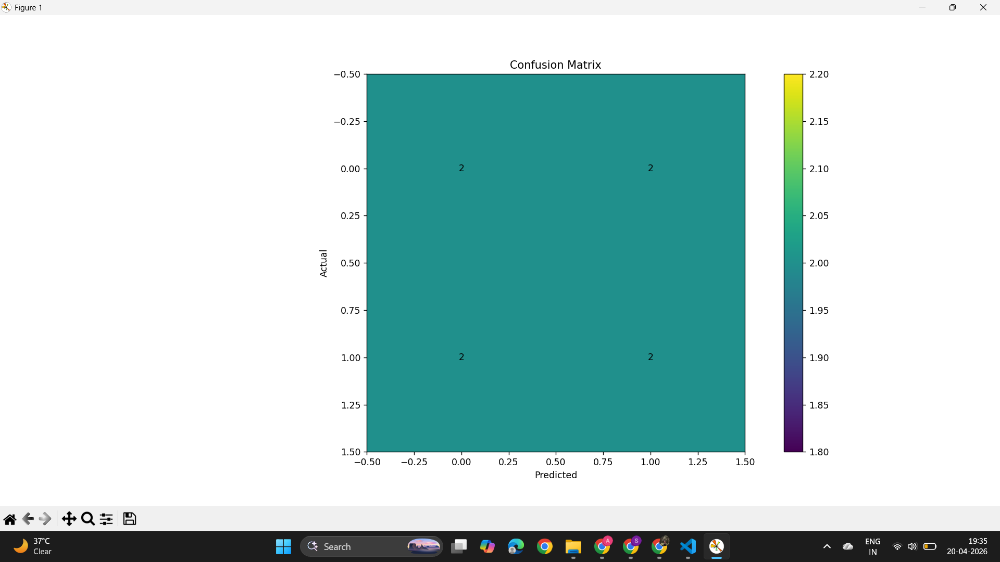
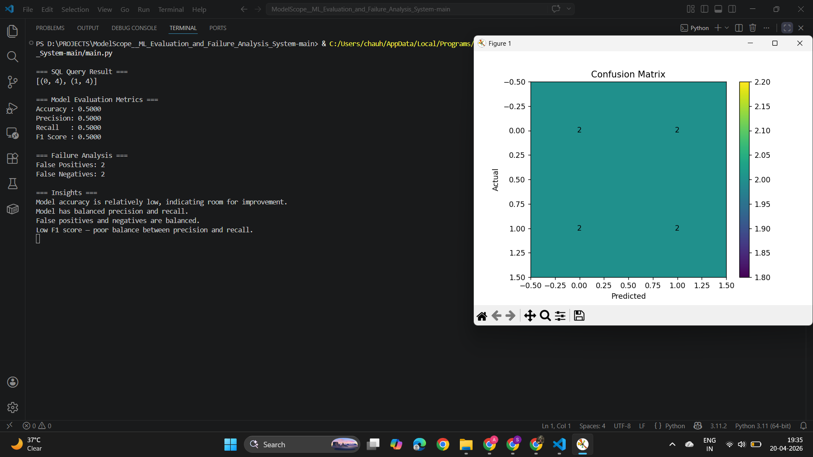

# ModelScope: ML Evaluation and Failure Analysis System

## Overview

ModelScope is a machine learning evaluation system designed to analyze model predictions, identify failure patterns, and generate actionable insights. The project simulates real-world evaluation workflows by combining statistical metrics, failure analysis, and visualization techniques.

It focuses on moving beyond basic accuracy metrics to provide deeper understanding of model behavior.

---

## Objectives

* Evaluate model performance using key classification metrics
* Identify and analyze failure cases such as false positives and false negatives
* Examine prediction patterns and model behavior
* Generate interpretable insights from evaluation results
* Visualize outputs for better understanding

---

## Technology Stack

* Python
* NumPy, Pandas
* Matplotlib
* SQLite (for data storage and querying)

---

## Project Structure

```id="p9r2k1"
ModelScope/
│
├── data/
│   ├── raw/
│   └── processed/
│
├── src/
│   ├── config.py
│   ├── data_loader.py
│   ├── metrics.py
│   ├── failure_analysis.py
│   ├── visualization.py
│   ├── db.py
│   ├── insights.py
│
├── main.py
├── modelScope_result.png
├── modelScope_visualisation.png
├── requirements.txt
└── README.md
```

---

## Features

### Model Evaluation

* Accuracy
* Precision
* Recall
* F1 Score

### Failure Analysis

* Identification of false positives
* Identification of false negatives
* Analysis of error distribution

### Data Storage and Querying

* Storage of predictions using SQLite
* Querying prediction distribution

### Visualization

* Confusion matrix
* Error distribution plots

### Insight Generation

* Automated interpretation of model performance
* Explanation of strengths and limitations

---

## Model Output

### SQL Distribution

```id="l7f3qa"
[(0, 4), (1, 4)]
```

### Evaluation Metrics

```id="r4m1tk"
Accuracy : 0.5000  
Precision: 0.5000  
Recall   : 0.5000  
F1 Score : 0.5000  
```

### Failure Analysis

* False Positives: 2
* False Negatives: 2

---

## Key Observations

The model demonstrates balanced but weak performance across all evaluation metrics. Equal counts of false positives and false negatives indicate no class-specific bias, but overall predictive capability is limited.

This suggests:

* The model lacks strong decision boundaries
* Further improvement is required through feature engineering or model tuning

---

## Visualizations

### Confusion Matrix

The confusion matrix below shows the distribution of correct and incorrect predictions across classes.



---

### System Output (Terminal)

The following output demonstrates the evaluation pipeline, including SQL results, metrics, failure analysis, and generated insights.



---

## How to Run

### 1. Clone the Repository

```id="z1m8rx"
git clone <repository-url>
cd ModelScope
```

### 2. Install Dependencies

```id="k2n7qa"
pip install -r requirements.txt
```

### 3. Execute the Program

```id="v8x3md"
python main.py
```

---

## Future Improvements

* Threshold tuning for improved performance
* Feature-level failure analysis
* Integration of interactive dashboards (e.g., Streamlit)
* Support for evaluating multiple models

---

## Conclusion

ModelScope provides a structured approach to evaluating machine learning models by combining metrics, failure analysis, and visualization. The project highlights the importance of understanding model behavior beyond standard accuracy measures.

---

## Author

Developed as part of a data analysis and machine learning portfolio project.
